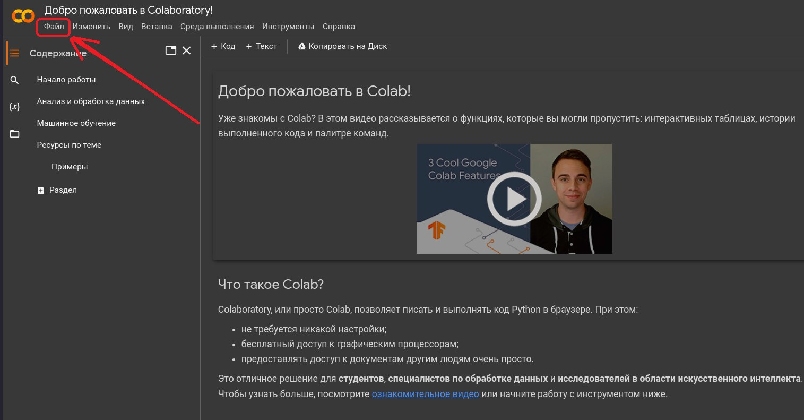
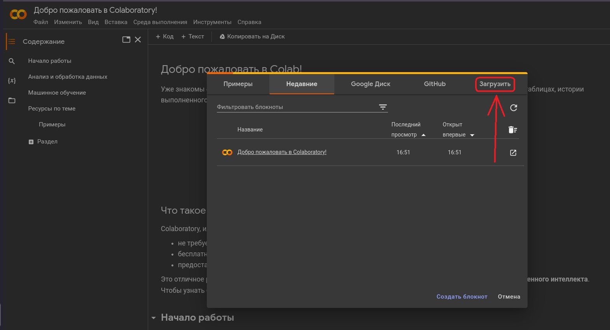
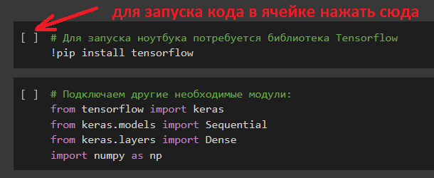

## Глава 1. Пишем и обучаем нашу первую нейронную сеть!

Прежде, чем мы приступим непосредственно к материалу этой главы, давайте я вам покажу очень хороший вопрос, который мне задал один из учеников, после того как прочитал введение и посмотрел дополнительные материалы:

*Здравствуйте, с материалом ознакомился, плюс-минус понял, но есть вопросы.
Первый вопрос и он самый главный: что всё таки представляет из себя нейросеть?) Так как я пользовался ChatGPT, то буду рассуждать, основываясь на нём. Используя эту нейросеть что я вижу? Чат, в котором я веду диалог, будто бы с живым человеком, но на самом деле ответы в этом чате генерирует робот. Но это лишь оболочка, а что представляет из себя этот чат с точки зрения программы? Это просто строчки программного кода? А что тогда придаёт этому коду возможность обучаться и анализировать? Тоже строчки программного кода?*

*И второй вопрос: если мы будем разрабатывать нейросеть, то я не до конца понимаю, что именно мы будем делать? Писать код?*

Отличные вопросы, как мне кажется! ⚡

Вот что я ответил: *Если совсем коротко ответить на твои вопросы, то мы будем рассматривать нейросети с точки зрения решения практических задач, в теорию глубоко погружаться не будем. Нейросеть представляет из себя набор различных "слоёв" нейронов. С программной точки зрения это просто код, написанный с использованием специальных библиотек, реализующих эти слои и связи между ними (слои и связи между ними образуют архитектуру нейронной сети). Можно брать этот готовый программный код, описывающий архитектуру той или иной модели нейросети и "обучать" сети самому, т е. подавать им на вход данные, смотреть результаты на выходе, сравнивать их с правильными результатами и корректировать настройки (веса) нейросети. Но для больших нейросетей обучение - это очень сложная задача, на обычном домашнем компьютере она нерешаема, поэтому зачастую разработчики выкладывают в свободном доступе уже предварительно обученные нейросети, которые пользователи потом "дообучают" на своей задаче - это значительно проще и быстрее.*

*Что касается ChatGPT - это предварительно обученная большая языковая модель, т.е. это опять же некий программный код (если упростить), через который прогнали терабайты текстовых данных. Обучение проводилось на тысячах мощных суперкомпьютеров и продолжалось многие месяцы. В итоге нейросеть "заучила" массу информации и "поняла" определенные закономерности. Но до настоящего искусственного интеллекта ей пока далеко.*

*И по второму вопросу: мы не будем разрабатывать нейросети "с нуля". Основной упор мы сделаем на понимание того, как подбирать необходимые модели нейросетей под конкретные задачи и как обучать эти нейросети на наших данных. Но код мы все равно писать будем)*

**✨ А теперь приступим к нашей главе 1.**

После такого активного изучения теории нам обязательно нужно попрактиковаться - мы с вами напишем и обучим простейшую нейронную сеть на Python!

Но сначала все-таки еще чуть-чуть теории) Попробуем разобраться, что такое **"функция активации"**?

Функция активации в нейронной сети – это как выключатель для нейрона. Она определяет, должен ли нейрон "активироваться" и передавать сигнал дальше по сети, или же его сигнал будет "заглушен".

Представим, что каждый нейрон в нейронной сети - это как "умный" светофор на перекрестке. Сигналы, которые приходят в нейрон, это автомобили, подъезжающие к светофору. Функция активации - это правило, по которому светофор решает, зеленый свет давать или красный. Допустим, что работа светофора зависит от количества автомобилей перед ним. Если автомобилей достаточно (условие выполняется), то светофор включает зеленый свет и автомобили (сигналы) едут дальше по сети. Если же автомобилей мало, светофор остается красным и сигналы дальше не передаются (автомобили останавливаются).

Существует несколько разных функций активации:

- Сигмоидальная функция: эта функция похожа на S-образную кривую. Она используется для бинарной классификации (когда нейрон должен выбрать один из двух вариантов).
- ReLU: эта функция простая и эффективная. Она используется для регрессии (когда нейрон должен предсказать числовое значение).
- Tanh: эта функция похожа на сигмоидальную функцию, но ее выходные значения находятся в диапазоне от -1 до 1.

Функции активации очень важны для работы нейронных сетей. Они позволяют нейронам учиться и делать прогнозы. Очень хорошая статья на эту тему: [Как объяснить функции активации вашему коту: простое руководство](https://habr.com/ru/companies/raft/articles/784964/).

✨ Возвращаемся к теме нашей главы - к написанию простейшей нейросети.

На свои компьютеры вам ничего ставить не придется, т.к. мы будем заниматься в облачной среде **Google Colab**, почитайте о ней самостоятельно, для начала можно [здесь](https://skilbox.ru/media/code/data_science_dostupnyy_kazhdomu/). Ну и любые другие материалы, которые найдете. 

Если вкратце: Google Colab - это бесплатная среда, которая позволяет писать и выполнять код Python в веб-браузере, не требуя никаких настроек и обеспечивая при этом доступ к огромному количеству библиотек для работы с нейросетями. Чтобы ей пользоваться нужно всего лишь иметь Гугл-аккаунт.

Программы в Google Colab принято называть "ноутбуками". Наши занятия в ближайшем будущем будут построены следующим образом: я буду выкладывать здесь упражнения в виде "ноутбуков", а вам нужно будет проделывать эти упражнения, используя Google Colab.

Очень краткая инструкция как загрузить ноутбук в Google Colab:

1. Входим в свой аккаунт Гугл
2. Открываем в браузере страничку https://colab.research.google.com/?hl=ru
3. Отобразится что-то типа этого:

4. В левом верхнем углу нажимаем меню "Файл" и затем "Загрузить блокнот" (показал на скриншоте красной стрелочкой)
5. Может открыться и такое окошко (см. ниже)), в этом случае так же нужно нажать "Загрузить".

Загружать будем вот этот ноутбук: [Simple_neural_network.ipynb.](notebooks/Simple_neural_network.ipynb)

Загрузите его в Google Colab и попробуйте проделать. Как вы наверное уже узнали из статей, в ячейках Colab можно запускать код на языке Python, как это сделать, показано на картинке ниже:

Инструкция к этому упражнению (ноутбуку) содержится в самом ноутбуке - загрузите его в Google Colab и все сами увидите. В упражнении мы рассмотрим простейшую нейросеть и научим ее выполнять логическую функцию XOR.

Вопросы конечно же будут, так что не стесняйтесь их задавать!

