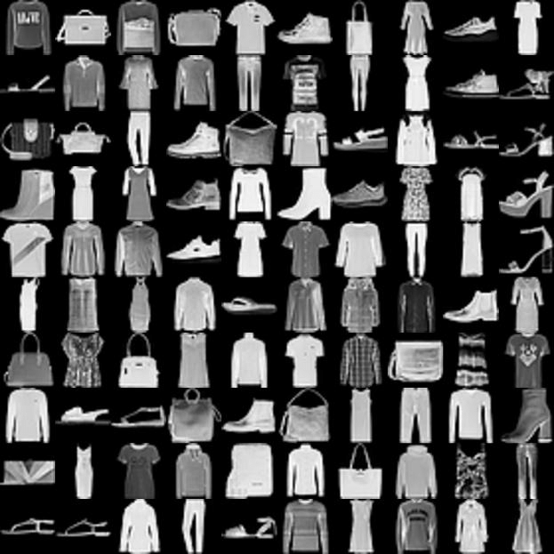

## Глава 3. Fashion MNIST и несколько замечаний к главе 2.

✨ В [упражнении](./notebooks/MNIST_in_Keras.ipynb) к [главе 2](CHAPTER2.md) мы сильно шагнули вперед, оставив позади некоторые важные моменты. Сейчас мы вернемся немного назад и их рассмотрим.

Дело в том, что в упражнении мы использовали библиотеку Keras, она очень удобна для быстрого создания и настройки моделей нейронных сетей, но из-за этого удобства многие важные моменты остаются, так сказать, "под капотом", т.е. скрыты от нас. Например, "под капотом" остался **метод обратного распространение ошибки** (и, соответственно, **алгоритм градиентного спуска**).
 
✨ Метод обратного распространения ошибки – это вероятно самая фундаментальная составляющая нейронной сети. Впервые он был описан в 60-е годы прошлого века. Метод используется для эффективного обучения нейронной сети с помощью следующего правила: после каждого прохода по нейронной сети обратное распространение выполняет проход в обратную сторону и регулирует параметры модели (веса и смещения).

✨ В рамках нашей простой нейронной сети единственными параметрами, участвующими в обучении сети, то есть в минимизации функции потерь (ошибки), являются **веса и смещения**. Веса изменяются на каждой итерации обучения, пока мы не приблизимся к минимуму функции потерь. Обратное распространение — это эффективный алгоритм нахождения оптимальных весов нейронной сети, то есть тех, которые оптимизируют функцию потерь. Стандартный способ нахождения этих весов - это применение алгоритма градиентного спуска. Тема это обширная, поэтому рекомендую почитать вот эту замечательную статью: [Как объяснить градиентный спуск вашей маме: простое руководство](https://habr.com/ru/companies/raft/articles/783918/).

Ну а мы продолжаем.
В новом упражнении мы будем классифицировать типы одежды на основе датасета **Fashion MNIST**.

Fashion MNIST содержит 70 000 изображений элементов одежды в 10 категориях в градациях серого. Изображения содержат элементы одежды в низком разрешении (28х28 пикселей), как показано на картинке ниже:

Скачайте и проделайте в Google Colab этот ноутбук: [FashionMNIST_in_Keras.ipynb](./notebooks/FashionMNIST_in_Keras.ipynb)

В ноутбуке как обычно все подробно прокомментировано. 

Напоминаю про вот это [отличное видео](https://www.youtube.com/watch?v=8mkh4uGxNfo) о работе с Fashion MNIST.